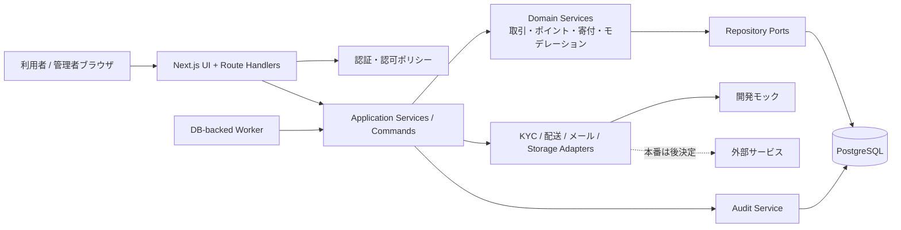

# アーキテクチャ

- 状態: Phase 1・2基盤を実装済み。ADR-0004・ADR-0005反映後の変更候補を含むが、コード・DBは未追随。
- 原則: モジュラーモノリス、サーバー側認可、追記型台帳、外部サービスはポート/アダプター

## 1. Phase 1採用構成

| 層               | 候補                                       | 理由・留保                                                           |
| ---------------- | ------------------------------------------ | -------------------------------------------------------------------- |
| Web/BFF          | TypeScript 6.0 + Next.js 16.2 + React 19.2 | 日本語Web、SSR、管理画面、APIを単一配布単位で開始                    |
| Runtime          | Node.js 24.18 / pnpm 11.9                  | `engines`、workspace設定、lockfileで固定                             |
| DB               | PostgreSQL 18                              | 制約、トランザクション、監査性、集計に適する                         |
| ORM              | Prisma 7.8 + PostgreSQL driver adapter     | 型安全とmigration。部分一意制約等はSQL migrationを併用               |
| 認証             | 実績あるセッション型認証ライブラリ         | 独自認証を避ける。ライブラリ選定とバージョンはADR化                  |
| Validation       | Zod 4.4                                    | UIと業務モデルを分け、境界入力だけ共有                               |
| Unit/Integration | Vitest 4.1 + Testing Library               | サービス層とコンポーネントを高速検証                                 |
| E2E              | Playwright 1.61                            | build済みstandalone成果物を検証                                      |
| Local            | Docker Compose                             | PostgreSQL、ローカルstorage volume、Mailpit、アプリを再現            |
| CI               | GitHub Actions（暫定）                     | lint、format、型、テスト、migration、build、container。Gitホスト未決 |

Redis、メッセージブローカー、検索エンジンはMVP開始時には導入しない。DBジョブテーブルで安全に開始し、負荷・運用要件が示した時だけ追加する。

## 2. 構造



HTTPハンドラは認証、入力検証、サービス呼出し、レスポンス変換に限定する。ReactコンポーネントからPrismaを直接呼ばず、業務ルールは `domain` / `application` へ置く。

## 3. 推奨ディレクトリ

```text
src/
  app/                       # ページ、レイアウト、薄いRoute Handlers
  modules/
    identity/                # 会員、プロフィール、KYC、権限
    pilot/                   # 招待、地域、登録上限、同意、制度版
    listings/                # 物品、画像、審査、禁止品
    transactions/            # 申込み、取引、配送、状態機械
    messaging/               # 取引メッセージ、検知
    safety/                  # 通報、ブロック、制裁、異議
    points/                  # 追記台帳、残高projection
    donations/               # 団体、期間、原資、配分、送金、公開
    privacy/                 # 開示・削除等申請、保持処理
    audit/                   # 監査ログ、CSVジョブ
  shared/
    auth/ validation/ errors/ db/ observability/ crypto/
prisma/
  schema.prisma
  migrations/
  seed.ts                    # 架空データのみ
config/
  moderation-rules.example.yml
  prohibited-items.example.yml
tests/
  integration/
  e2e/
```

モジュール間参照は公開されたサービス/型だけに限定し、循環参照をCIで検査する候補とする。

## 4. 業務サービス境界

### PilotEnrollmentService

- `issueInvitation`, `revokeInvitation`, `registerInvitedMember`, `recordConsents`
- 運営発行の単回招待、18歳以上の個人、1人1アカウント、登録上限50、全国公開offをサーバー側で検証
- 招待使用・枠確保・同意証跡・監査を原子的または回復可能なsagaとして扱い、open registrationへfallbackしない

### KycPolicyService

- 閲覧・仮登録はKYC不要、物品登録・受取申込み・取引参加は有効なverified KYC必須という用途別policyを返す
- adapterの結果を各UIから受け取らず、サービス入口で最新caseを再評価する
- 本番でmockまたは設定欠落の場合は必須操作をfail closedにする

### TransactionService

- `requestItem`, `selectRecipient`, `acceptSelection`, `scheduleHandover`
- `reportProviderComplete`, `reportRecipientComplete`, `startAdminReview`
- `finalizeAfterAdminReview`, `dispute`, `cancel`, `suspend`
- 状態、actor、対象所有権、KYCポリシー、ブロック状態、同時更新を検証
- 当事者報告、現実の引渡し申告、双方報告、運営確認を別事実として扱う。運営確認を所有権移転の要件にしない

### PointLedgerService

- `postTransactionAward`, `holdEntry`, `reverseEntry`, `expireAvailablePoints`, `moveHoldingCapOverflow`
- 原取引ごとの基本1・配送加算0〜3・合計1〜4、ポリシー版、冪等キー、取消し参照を検証
- `getAvailableBalance` は台帳集計/projectionから返し、直接更新APIを持たない
- 利用可能残高30の判定は利用者単位に排他し、超過outとpool inを同一DBトランザクションで追記する
- 1年後の月末失効、60/30/7日前通知、開発データ除外、ルール非遡及をpoint policy版で再現する

### DonationAllocationService

- `allocateVotes`, `closePeriod`, `calculatePlan`, `approvePlan`
- ポイント予約/消費方式と端数処理は未決の戦略として差し替え可能にする
- 計算入力とアルゴリズム版のスナップショットを保存

### ModerationService

- 有効期間付きルール設定を読み、正規化した本文と照合
- `warn` / `hold` / `allow` を返し、イベントを追記
- 制裁決定は別の `EnforcementService` が権限・理由・異議を扱う

### AuditService

- 重要コマンドと同一DBトランザクション内で監査イベントを追記
- 秘密、パスワード、トークン、住所全文、追跡番号、メッセージ全文を変更差分へ保存しない
- 監査失敗時は重要操作自体を失敗させる

## 5. API設計原則

- 状態の汎用 `PATCH {status}` を禁止し、意図を表すコマンドエンドポイント/Server Actionを使う。
- Cookieベースのセッション、`HttpOnly`, `Secure`, `SameSite` とCSRFトークン/Origin検査を採用する。
- すべての変更系入力をスキーマ検証し、認証後も対象単位の認可を行う。
- 重要なPOSTは `Idempotency-Key` を受け、同じキーの二重実行を防ぐ。
- エラーは安定したコードと安全な日本語メッセージを返し、内部例外・SQL・スタックを返さない。
- 一覧はカーソルページング、CSVは非同期ジョブ。検索条件とエクスポート実行を監査する。
- 公開APIと管理APIはルート、認可ポリシー、レート制限を分離する。

## 6. 認証・認可

- メール確認前、KYC状態、アカウント制裁状態をロールと別軸で評価する。
- 登録は運営発行の有効な単回招待、18歳以上確認、規約/プライバシー版付き同意、登録枠を要求する。利用者の自由な再招待は許可しない。
- 物品登録・受取申込み・取引参加は有効なverified KYCを必須とし、閲覧・仮登録には要求しない。
- 正確な受渡情報は `accepted` 後のprovider/recipientだけへ最小開示し、管理アクセスも目的・権限・監査を要求する。
- RBACに対象所有権・参加者条件を加えたポリシー関数を使う。
- 認可はUI表示制御に加え、サービス入口で必須。高リスク操作は再認証/MFAを将来ゲートとして設計する。
- 管理者アカウントと一般利用を分離するかは未決。少なくとも管理セッションの短命化、MFA、IP/端末通知を本番ゲート候補とする。
- 権限変更、制裁、寄付承認、証明公開、CSVは監査必須。

## 7. 外部アダプター

```ts
interface KycProvider {
  start(
    userId: string,
    callbackUrl: string,
  ): Promise<{ referenceId: string; redirectUrl?: string }>;
  getStatus(referenceId: string): Promise<"unverified" | "pending" | "verified" | "rejected">;
}

interface ShippingProvider {
  lookup(carrier: string, trackingToken: string): Promise<{ status: string; occurredAt?: Date }>;
}
```

上記は概念例であり、実装時の公開型を固定するものではない。モックは状態だけを生成し、本人確認書類画像・実住所・実追跡番号を含めない。Webhookは署名、リプレイ防止、冪等性を実装してから本番接続する。

## 8. ファイル・画像

1. アップロード開始時にサイズ、個数、拡張子を検証する。
2. アプリサーバーが発行した短命な署名URLで隔離領域へ保存する。
3. 実データのMIME/マジックバイト、画像デコード、寸法、メタデータを検査する。
4. SVG、HTML、スクリプト、実行形式、多重形式、異常圧縮を拒否する。
5. EXIFを除去し、サーバー側で安全なJPEG/WebP/PNGへ再エンコードする。
6. 検査済み派生画像だけを公開領域へ移す。

送金証明は物品画像と別バケット/権限にし、原本は非公開、公開用墨消し版は別オブジェクトとして承認履歴を持つ。

## 9. 整合性と非同期処理

- 運営上の取引確定と正式ポイント付与は同一DBトランザクションで結合する。双方報告だけでは正式ポイントを作らない。
- 30上限超過時の利用者台帳out、共通pool台帳in、移動link、監査は同一DBトランザクションで追記する。
- 失効処理も利用者outとpool inを原子的に追記し、元付与行を更新しない。
- 通知はoutboxから送信し、業務トランザクション内で外部APIを呼ばない。
- ワーカーは `FOR UPDATE SKIP LOCKED` 等でジョブを取得し、試行回数・次回実行・dead-letter状態を持つ。
- 寄付計算はスナップショット入力、アルゴリズム版、実行者、チェックサムを保存する。
- 公開透明性ページは承認済み公開版だけを読み、作業中データを直接表示しない。

## 10. 環境

| 環境       | データ                 | 外部接続                       |
| ---------- | ---------------------- | ------------------------------ |
| local      | 固定の架空seed         | KYC/配送/メール/Storageモック  |
| test       | テストごとに分離・破棄 | すべてfake                     |
| staging    | 合成データ             | sandboxのみ、明示設定          |
| production | 本番データ             | 承認済み事業者、secret manager |

本番データをlocal/stagingへコピーしない。環境名だけで安全機能を無効化せず、モックアダプターはproduction起動時にfail closedとする。

実証運用ではpilot mode=true、登録上限50、全国公開=false、招待制=trueを安全側既定値とする。周辺地域の具体範囲と本番開始日時は承認済みDB設定として持ち、欠落時は登録・公開・正式ポイント付与を拒否する。

## 11. 保留する技術判断（ADR候補）

1. ADR-001: 認証ライブラリ、セッション永続化、管理者MFA
2. ADR-002: Next.js/Node/Prismaの固定バージョンと更新方針
3. ADR-003: オブジェクト保存とマルウェア検査方式
4. ADR-0004（採用済み）: 実証運用、招待、利用者資格、同意、KYC
5. ADR-0005（採用済み）: 所有権・取引完了の用語とポイント運用
6. ADR候補: ポイント配分の予約/消費と期限別消費順
7. ADR候補: 寄付端数処理と再計算版管理
8. ADR候補: PIIフィールド暗号化と鍵ローテーション
9. ADR候補: デプロイ先、バックアップ、RPO/RTO
