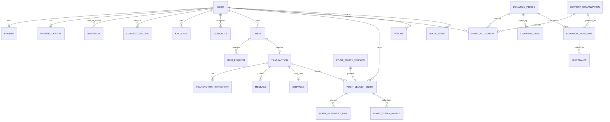

# データモデル案

- 状態: ADR-0004・ADR-0005反映版。PD-01〜PD-07のexpand migrationとアプリ基盤を実装済み。feature flag有効化と本番運用値は未承認。
- ID: 外部に連番を露出しないUUID/UUIDv7系を候補とする。
- 時刻: DBはタイムゾーン付きUTC。表示と期間締切はAsia/Tokyoを明示。
- 金額: 整数円。ポイント: 符号付き整数（取消し仕訳を表現）。

### 実装注記

- `transactions`, `transaction_status_events`, `point_ledger_entries`, `common_pool_ledger_entries` を実装した。
- `point_ledger_entries` と `common_pool_ledger_entries` に残高カラムはない。
- 利用者残高は `status=POSTED` の符号付きポイント合計から算出し、`HELD` は除外する。
- 取消し・共通プール移行は `reversal_of` を持つ負数仕訳で元記録を相殺する。元記録は更新しない。
- ポイント台帳、共通プール台帳、取引状態イベントはDBトリガーで更新・削除を拒否する。
- 金額、送料額、円換算率、ポイント送金先を表す列は追加していない。
- 招待、同意・年齢証跡、KYC guard、有効期限、30ポイント上限、部分pool移行、ポリシー版を追加した。既存台帳行の新分類列はNULLのままで正式残高に含めない。

## 1. 関係概要

## 2. ID・アカウント・個人情報

### `users`

`id`, `email_normalized` (unique), `email_verified_at`, `password_hash`（認証方式に応じる）, `account_status`, `account_type`, `pilot_membership_status`, `created_at`, `updated_at`, `last_login_at`

- `account_status`: `active`, `warning`, `temporarily_suspended`, `permanently_suspended`, `withdrawal_requested`, `withdrawn`
- `account_type` は初期MVPで `individual` だけを許可する。将来の法人・団体対応を自動的に有効化しない。
- メール原文/正規化方針、削除後の再登録防止用ハッシュ保持は法務・運用確認後に決める。

### `service_policy_versions`, `pilot_settings`

- `service_policy_versions`: `id`, `version`, `effective_from`, `production_started_at`, `status`, `approved_by`, `approved_at`, `reason`, timestamps
- `pilot_settings`: `id`, `policy_version_id`, `region_label`, `allowed_area_config_json`, `registration_limit`, `nationwide_public_enabled`, `invite_only`, `effective_from/to`, `approved_by`, timestamps
- 初期値は倉敷市および周辺地域、上限50、全国公開false、招待制true。設定なしでは登録と全国公開をfail closedにする。
- 「周辺地域」の具体範囲と50名に算入するアカウント種別は承認済み設定で表現し、コードへ固定しない。

### `invitations`

`id`, `code_hash`, `source`, `issued_by_user_id`, `issued_at`, `expires_at`, `used_at`, `used_by_user_id`, `revoked_at`, `revoked_by_user_id`, `revoke_reason`, `status`, `created_at`

- `code_hash` はunique。生コードは発行レスポンス以外へ保存しない。
- `status`: `issued`, `used`, `expired`, `revoked`。単回利用をDB制約と排他制御で保証する。
- `source` は招待元となる運用施策・相談会等の識別子であり、一般利用者による招待権限を表さない。
- 発行、使用、失効、取消しの監査イベントを招待行と同じDBトランザクションで追記する。

### `profiles`

`user_id`, `display_name`, `bio`, `prefecture_code`（粗い地域）, `avatar_asset_id`, timestamps

住所、電話、本人確認情報を含めない。

### `private_identities`

`user_id`, `legal_name_ciphertext`, `postal_code_ciphertext`, `address_ciphertext`, `phone_ciphertext`, `key_version`, timestamps

行/列レベル暗号化の具体方式はADR-006。検索が必要な値は正規化ハッシュを別途持つ案を脅威評価する。

### `kyc_cases`

`id`, `user_id`, `provider`, `provider_reference_token`, `status`, `valid_from`, `valid_until`, `submitted_at`, `decided_at`, `reason_code`, `reviewed_by`, `supersedes_case_id`, timestamps

- `status`: `unverified`, `pending`, `verified`, `rejected`
- 本人確認書類画像は原則アプリDB・通常オブジェクト保存に置かない。外部参照もトークン化する。
- 現在の有効KYCは履歴行から導出し、過去行を上書きしない。出品・申込み・取引参加コマンドは `verified` かつ有効期間内をguardとする。

### `roles`, `permissions`, `user_roles`, `role_permissions`

有効期間、付与者、理由を保持する。ロール固定enumだけにせず、権限を明示的に対応付ける。基準ロールは `user`, `moderator`, `donation_reviewer`, `administrator`, `auditor`。

### `consent_records`

`id`, `user_id`, `record_type`, `document_version`, `confirmed_at`, `withdrawn_at`, `evidence_hash`, `source`, `policy_version_id`, `created_at`

- `record_type`: `terms_agreement`, `privacy_policy_acknowledgement`, `age_18_or_over_confirmation`。
- 規約・プライバシー文書の版、18歳以上確認、時刻、経路を追記保持する。既存記録を更新せず、撤回や再同意も新しい記録・イベントで表現する。
- IPの保存は必要性と期間を確認してから決める。生年月日はこの決定だけを理由に保存しない。

## 3. 掲載・申込み・取引

### `items`

`id`, `owner_user_id`, `title`, `description`, `category_id`, `condition`, `defect_description`, `delivery_method`, `handover_area`, `available_dates_json`, `shipping_supported`, `status`, `review_status`, `rejection_reason_code`, `published_at`, `created_at`, `updated_at`, `version`

- 依頼された最低項目を満たす。
- `images` は配列カラムではなく `item_images` へ分離。
- 金額・希望価格・希望ポイント列は作らない。
- create/update/submitのサービスguardで有効なverified KYCとpilot資格を要求する。KYC状態をitemへ複製せず、判断時のKYC case IDを審査・監査へ参照保存する案とする。

### `item_images`

`id`, `item_id`, `asset_id`, `sort_order`, `scan_status`, `created_at`

### `categories`, `prohibited_item_rules`, `item_review_events`

- ルールは `version`, `effective_from/to`, `match_type`, `action`, `reason`, `enabled` を持つ。
- `action`: `reject`, `manual_review`, `warn`。初期許可リスト方式を候補とする。
- 審査イベントは判定ルール版、判断者、理由を追記する。

### `item_requests`

`id`, `item_id`, `requester_user_id`, `message`, `status`, `requested_at`, `selected_at`, `withdrawn_at`, timestamps

- 状態候補: `requested`, `selected`, `not_selected`, `withdrawn`, `expired`, `cancelled`
- unique (`item_id`, `requester_user_id`) の扱い（再申込み可否）は未決。

### `transactions`

`id`, `item_id`, `selected_request_id`, `provider_user_id`, `recipient_user_id`, `status`, `status_version`, `risk_review_status`, `provider_reported_at`, `recipient_reported_at`, `both_reported_at`, `handover_occurred_at`, `admin_finalized_at`, `admin_finalized_by`, `cancel_reason`, `created_at`, `updated_at`

- provider != recipientをDBチェック。
- 1 itemにつき非取消の有効transaction最大1を部分一意制約で保証する案。
- 状態は `state-machines.md` に従い、汎用更新を禁止。
- `handover_occurred_at` は当事者の申告する現実の引渡し日時であり、運営者による所有権判定を表さない。
- `provider_reported_at`、`recipient_reported_at`、`both_reported_at`、`admin_finalized_at` を分離する。`completed_at` 既存列は非破壊移行期間中だけlegacy aliasとして扱い、新規UI/APIでは「運営確認日時」と明示する。
- 正確な受渡情報は通常transaction行に置かず、取引成立後の当事者だけが取得できる暗号化領域とアクセスポリシーへ分離する。

### `transaction_status_events`

`id`, `transaction_id`, `from_status`, `to_status`, `event_type`, `actor_user_id`, `actor_role`, `reason`, `metadata_safe_json`, `created_at`

現在状態とは別に遷移履歴を追記する。`transactions.status` は検索用projection。

### `transaction_risk_signals`

`id`, `transaction_id`, `signal_type`, `severity`, `evidence_reference`, `detected_at`, `review_status`, `reviewed_by`, `review_reason`

同一人物・不自然関係を示すシグナルを保存する。住所・端末等の生値は保存せず、アクセス制御された照合結果/ハッシュを検討する。シグナルだけで自動処分しない。

## 4. メッセージ・配送・安全

### `messages`

`id`, `transaction_id`, `sender_user_id`, `body_ciphertext`, `status`, `sent_at`, `released_at`, `deleted_for_user_at`

- `status`: `pending_scan`, `visible`, `held`, `removed`
- 取引参加者だけが閲覧可能。運用者の閲覧は目的・権限・監査を必要とする。

### `moderation_rules`, `moderation_rule_versions`, `moderation_events`

- ルール: pattern（暗号化不要だが管理限定）, match type, normalization, action, severity, reason, effective period。
- イベント: `message_id`, `rule_version_id`, `matched_fragment_masked`, `action`, `review_status`, `reviewed_by`, `decision`, `reason`, timestamps。
- 一般ログに本文・一致全文を出さない。

### `shipments`

`id`, `transaction_id`, `carrier`, `tracking_number_ciphertext`, `tracking_lookup_hash`, `shipping_method`, `shipped_at`, `delivery_status`, `delivered_at`, `recipient_confirmed_at`, `shipping_workload_level`, `admin_verified_at`, `verified_by`, timestamps

- `shipping_workload_level`: `none=0`, `simple=1`, `standard=2`, `large_special=3`。提供者申告と配送記録を基に運営者がポイント確定時に確認する。対面のみは0。
- 追跡番号はレスポンスにも必要時だけマスク解除。ログ・監査差分には載せない。

### `reports`, `blocks`, `enforcement_actions`, `appeals`

- `reports`: 対象種別/ID、申告者、分類、説明、証拠、状態、担当者、決定理由。
- `blocks`: blocker, blocked, created_at, released_at。自己ブロック不可、同一ペアの有効行を一意にする。
- `enforcement_actions`: warning/temporary/permanent、開始/終了、理由、根拠、実行者。
- `appeals`: 処分参照、申立人、理由、状態、別審査者、決定。

## 5. ポイント（追記型）

### `point_policy_versions`

`id`, `version`, `effective_from`, `production_started_at`, `base_award_points`, `shipping_bonus_max`, `transaction_total_max`, `available_balance_cap`, `expiry_rule`, `timezone`, `status`, `approved_by`, `approved_at`, `created_at`

- 初期正式版は基本1、配送加算最大3、取引合計最大4、利用可能残高上限30、付与日の1年後の月末失効、Asia/Tokyoとする。
- 版は不変とし、変更時は新しい行と適用開始日時を追加する。既存ポイントへ自動遡及しない。
- `production_started_at` より前の開発仕訳、または正式ポリシー版へ紐づかない既存仕訳は正式残高から除外する。

### `point_ledger_entries`

| 列                   | 説明                                                                                                                                                         |
| -------------------- | ------------------------------------------------------------------------------------------------------------------------------------------------------------ |
| `id`                 | 一意ID                                                                                                                                                       |
| `transaction_id`     | 取引由来の場合の参照。配分/失効等はnullable                                                                                                                  |
| `user_id`            | 台帳所有者                                                                                                                                                   |
| `event_type`         | `base_award`, `shipping_bonus`, `allocation_reserve`, `allocation_consume`, `release`, `expiry`, `common_pool_transfer`, `reversal`, `manual_adjustment`候補 |
| `points`             | 符号付き整数                                                                                                                                                 |
| `reason`             | 必須の安全な理由                                                                                                                                             |
| `created_at`         | 作成時刻                                                                                                                                                     |
| `created_by`         | systemまたは実行者ID（actor型を分ける案）                                                                                                                    |
| `reversal_of`        | 取消対象entry。自己参照不可                                                                                                                                  |
| `status`             | `pending`, `posted`, `held`, `reversed`, `rejected`候補                                                                                                      |
| `idempotency_key`    | 二重付与防止。unique                                                                                                                                         |
| `metadata_safe_json` | 計算版等。PII禁止                                                                                                                                            |
| `policy_version_id`  | 正式ポイントに適用したpoint policy。既存開発仕訳はnullable                                                                                                   |
| `awarded_at`         | 付与基準日時。`created_at` と分離して期限計算を再現                                                                                                          |
| `expires_at`         | 1年後の月末終了後に利用不可となる時刻。Asia/TokyoからUTCへ変換した確定値                                                                                     |
| `award_group_id`     | 同一取引の基本付与・配送加算・上限超過移行を束ねるID                                                                                                         |

最低要件9項目を含む。`UPDATE`/`DELETE`をDBトリガーとアプリ権限で禁止し、訂正は反対符号の新規entryで行う。`reversed` は原行を書き換える意味にせず、反対仕訳存在によるprojectionとする。

イベント型へ `holding_cap_overflow_out` と `expiry_out` を追加する。どちらも取消しではないため `reversal_of` を使用しない。

### `point_movement_links`

`id`, `movement_type`, `source_point_entry_id`, `user_out_entry_id`, `pool_in_entry_id`, `points`, `policy_version_id`, `idempotency_key`, `created_at`, `created_by`

- `movement_type`: `holding_cap_overflow`, `expiry`, `unallocated`。
- 部分移動を許容し、1つの元付与に複数回の移動が関連できる。移動済み合計が元付与の利用可能残存量を超えないよう、サービスの排他制御とDBトランザクションで保証する。
- 利用者負数仕訳、pool正数仕訳、movement link、監査、outboxを同一DBトランザクションで追記する。

### `point_expiry_notifications`

`id`, `user_id`, `point_entry_id`, `notice_days`, `scheduled_for`, `status`, `outbox_event_id`, `sent_at`, `failure_code`, `idempotency_key`, `created_at`

- `notice_days` は初期版で60、30、7。entryと日数の組をuniqueにし、通知再試行で重複送信しない。
- 通知失敗は失効自体を止めない。通知経路・再送回数は運用設定として別途決定する。

### `point_balance_projections`

任意の性能用キャッシュ: `user_id`, `posted_balance`, `reserved_balance`, `calculated_through_entry_id`, `updated_at`。

真実の源泉ではない。再構築・照合ジョブと差異アラートを必須にする。管理UIから更新不可。

### 不変条件

- 取引由来の確定基本付与は1取引1回。
- 配送加算は0..3、取引由来の基本+配送加算は1..4。通常確定時は基本1必須。
- 正式付与は `admin_finalized_at` より前に作成しない。
- 正式な利用可能残高は30以下。超過分の利用者outとpool inを同一DBトランザクションで記録する。
- 正式ポイントは付与日の1年後が属する月末まで利用可能。失効は元行を変えずout仕訳とpool inを追記する。
- 本番開始前または正式ポリシー版なしの開発仕訳は正式残高に含めない。
- `reversal_of` は同一ユーザー/対象文脈で、1原行への有効取消しは最大1（再取消しは取消し行を反対仕訳）。
- 残高と配分可能額は同じ概念ではない。予約中を分離する。

## 6. 寄付（ポイントと現金を分離）

### `support_organizations`, `organization_reviews`

団体基本情報、公開情報、審査状態 (`draft`, `pending_review`, `approved`, `suspended`, `rejected`)、審査基準版、判断者、理由、再審査期限。振込先口座は別の暗号化領域とし公開情報に含めない。

### `donation_periods`

`id`, `title`, `allocation_starts_at`, `allocation_ends_at`, `timezone`, `status`, `calculation_version`, `approved_by`, timestamps

要求された9状態を持つ。現在状態に加え `donation_period_status_events` を追記。

### `point_allocations`

`id`, `period_id`, `user_id`, `organization_id`（共通プールは専用主体/別種別を検討）, `points`, `status`, `ledger_entry_id`, `created_at`, `updated_at`, `version`

ポイントの予約・変更・確定方式はC-102の決定後に確定する。

### `donation_funds`

`id`, `period_id`, `source_category`, `amount_yen`, `description`, `status`, `registered_by`, `approved_by`, timestamps

ポイント列を持たない。`source_category` は協賛、広告、助成、事業収入、繰越等の設定マスタ参照。

### `donation_calculation_runs`, `donation_plan_lines`

- run: 入力締切、総票数、対象原資額、アルゴリズムID/版、入力チェックサム、実行者、実行時刻、状態。
- line: 団体、票数、比率（分子/分母または高精度decimal）、予定整数円、端数順位、繰越整数円。
- 「1ポイント当たり円額」を列・表示として持たない。

### `remittances`, `remittance_proofs`, `transparency_publications`

- remittance: plan line、実送金整数円、送金日、状態、外部参照トークン、登録者、承認者。
- proof: 非公開原本asset、公開用墨消しasset、審査状態、公開承認者。
- publication: period、版、公開JSONスナップショット、公開時刻、公開者、更新理由、チェックサム。

## 7. プライバシー・監査・運用

### `privacy_requests`

`id`, `user_id`, `request_type`, `scope`, `status`, `identity_verified_at`, `received_at`, `due_at`, `decided_at`, `decision_reason`, `handled_by`

- `request_type`: `access`, `correction`, `deletion`, `restriction`, `withdrawal`
- 法令上の呼称・権利範囲をUIで断定せず、規約・ポリシー確定時にレビュー。

### `retention_holds`, `data_disposition_jobs`

- 対象、根拠、開始/終了、承認者を持ち、削除申請と紛争・監査・会計保存の競合を明示する。
- 削除は物理削除、匿名化、利用停止、保持のいずれかをデータ分類ルールに従い記録。

### `audit_events`

`id`, `occurred_at`, `actor_type`, `actor_id`, `actor_role`, `action`, `target_type`, `target_id`, `reason`, `before_safe_json`, `after_safe_json`, `request_id`, `ip_risk_token`, `result`

追記専用、改ざん検知（ハッシュチェーン/外部WORMはリスク評価後）、アクセス自体も監査。PII・秘密は保存しない。

### `outbox_events`, `background_jobs`, `export_jobs`

通知・非同期処理・CSVを冪等かつ監査可能にする。エクスポート成果物は暗号化、短期失効、ダウンロード監査、完了後削除。

## 8. インデックス・制約候補

- 全外部キー、一覧の `(status, created_at)`、台帳 `(user_id, created_at, id)`
- item requestの `(item_id, status)`、transactionの参加者 + status
- moderation eventの `(review_status, created_at)`
- donation periodの状態・期間重複制約（同時openを許すかは未決）
- 小文字正規化メールのunique、冪等キーunique
- `points <> 0`, workload 0..3, `amount_yen >= 0`, 期間開始 < 終了
- invitation `code_hash` unique、使用者/使用日時の整合check、単回使用の条件付きunique
- point policyの `base=1`, `shipping_bonus_max=3`, `transaction_total_max=4`, `available_balance_cap=30` は初期版作成時と付与処理の双方で検証
- point movementの利用者out絶対値 = pool in = link points、すべて正数

Prismaで表現できない部分一意制約、追記禁止、複雑なcheckはSQL migrationとDB権限で補う。DB制約だけに頼らず、同じ不変条件をドメインテストする。

## 9. 未決データ設計

- 配分予約中・HELD・取消し処理中を利用可能残高へ含める規則
- 期限の異なるポイントの消費順序と、部分配分・取消し時のsource entry割当
- 招待の上限50名に算入するaccount状態・staff/seedの扱い
- 「倉敷市および周辺地域」の具体的な許可範囲データ
- 1人1アカウント確認の照合キー、例外審査、保持期間
- KYC失効時の進行中取引解除・管理介入データ
- メッセージ本文の暗号化、管理閲覧、保持期間
- PIIの暗号化検索と鍵管理
- KYC参照情報・審査結果の保持期間
- 同一人物/関係性シグナルの根拠と保存可否
- 端数配分アルゴリズム
- 監査ログ・取引・寄付証憑の保存期間
- 削除/匿名化後も保持する最小識別子
