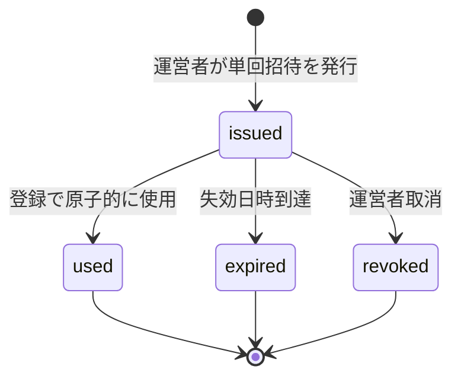
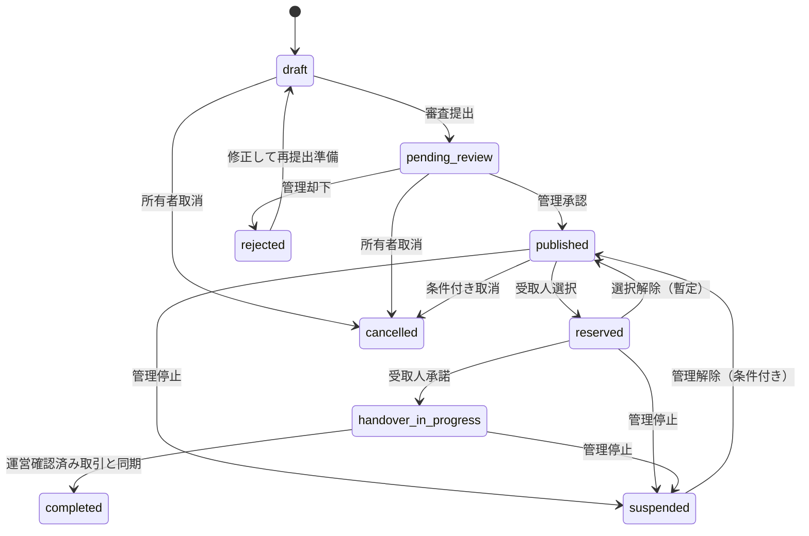
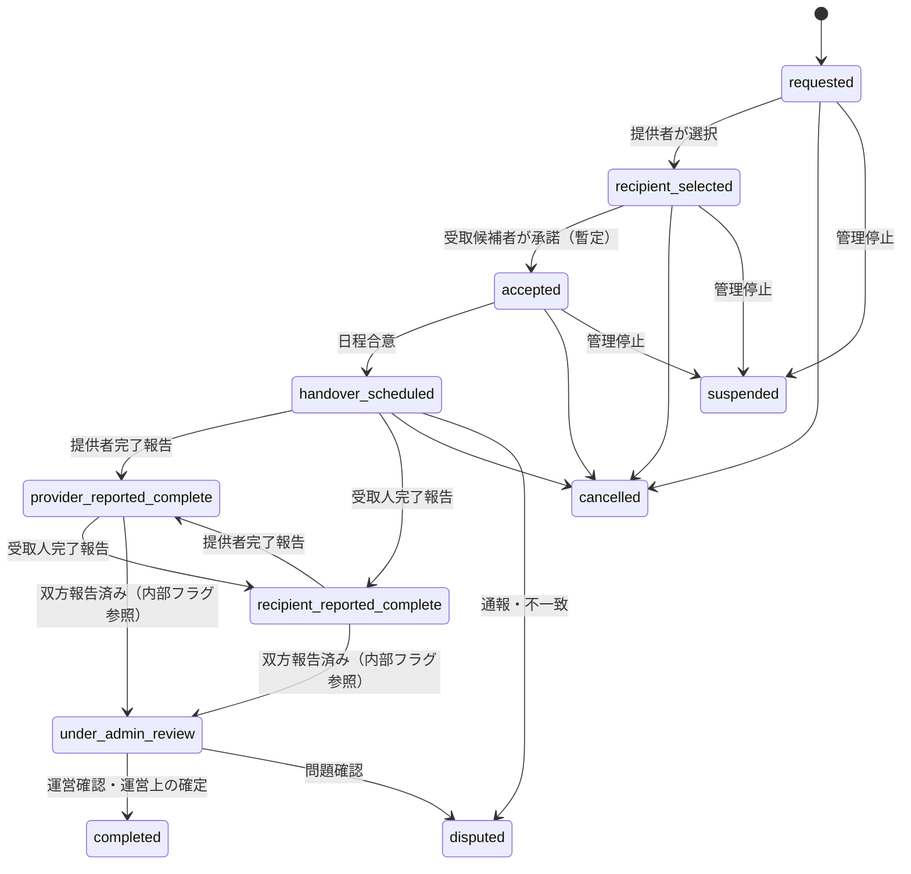
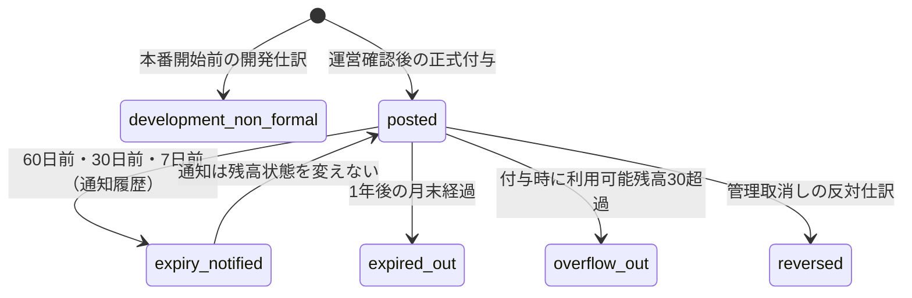
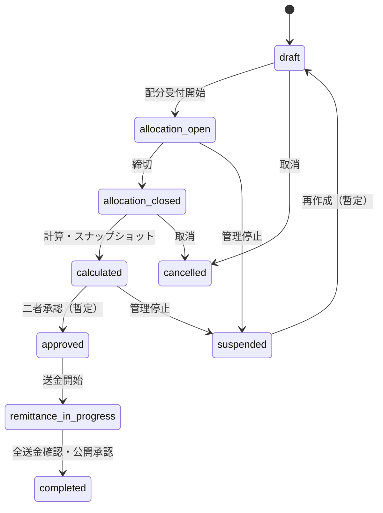

# 状態遷移設計

- 状態: ADR-0004・ADR-0005反映版。フェーズ2対象の取引主要遷移は実装済みだが、新決定へのコード追随は未実施。
- 重要: `暫定` と記した遷移は、人間の決定前に本番仕様として固定しない。
- 共通原則: クライアントは遷移イベントを要求するだけで、現在状態、actor、権限、guardをサーバー側サービスが検証する。遷移と履歴・監査・outboxは同じDBトランザクションで記録する。

### フェーズ2実装注記

- 受取人選択時に `recipient_selected` の取引を生成する。
- `recipient_selected -> accepted -> handover_scheduled` を明示コマンドで進める。
- 提供者・受取人の報告時刻を別々に保持し、双方が揃った場合だけ `under_admin_review` へ進む。
- `under_admin_review -> completed / disputed / cancelled` は moderator / administrator の確認コマンドに限定する。
- 保留後の `disputed -> completed / cancelled` は暫定実装であり、SLA・追加証跡は人間の決定待ち。
- 各遷移は楽観ロック付きで更新し、状態イベントはDBで追記専用とする。

### 用語上の不変条件

- 所有権移転は当事者間の合意および現実の引渡しによる。以下のDB状態や管理者操作を所有権移転の要件として扱わない。
- `provider_reported_complete` / `recipient_reported_complete` は、各当事者によるプラットフォーム上の完了報告である。
- `under_admin_review` は双方報告後の運営確認待ちであり、「所有権未移転」を意味しない。
- `completed` は運営上の取引確定を表す内部状態であり、利用者向けには「運営確認済み」と表示する。
- 運営確認はポイント確定の必要条件だが、所有権移転の必要条件ではない。

## 0. 招待・登録・KYC資格

招待とKYCは、画面表示だけでなく各コマンドのサーバー側guardとして扱う。

| From     | Command / actor           | To        | Guard・副作用                                                                                   |
| -------- | ------------------------- | --------- | ----------------------------------------------------------------------------------------------- |
| —        | issue / administrator     | `issued`  | 発行者・招待元・失効日時を記録。生コードは保存しない                                            |
| `issued` | register / invited person | `used`    | 有効、未使用、18歳以上確認、規約/プライバシー同意、個人、登録枠あり。使用と枠確保を原子的に処理 |
| `issued` | expire / system           | `expired` | 失効日時、冪等、監査追記                                                                        |
| `issued` | revoke / administrator    | `revoked` | 理由必須、監査追記                                                                              |

KYC状態は `unverified -> pending -> verified/rejected` を基本とする。公開閲覧と仮登録はどのKYC状態でも可能だが、物品登録・下書き保存・投稿申請、受取申込み、受取人承諾、日程合意、取引メッセージ、完了報告は `verified` の場合だけ許可する。進行中取引でKYCが失効・取消しとなった場合は自動取消しせず、当該コマンドを停止して管理レビューへ送る。

## 1. 物品掲載

| From                   | Event / actor            | To                     | Guard・副作用                                              |
| ---------------------- | ------------------------ | ---------------------- | ---------------------------------------------------------- |
| —                      | create draft / owner     | `draft`                | `verified` KYC、個人利用者、地域・アカウント資格           |
| `draft`                | submit / owner           | `pending_review`       | `verified` KYC、必須項目、画像検査済み、カテゴリルール評価 |
| `pending_review`       | approve / moderator      | `published`            | 理由・審査ルール版を記録                                   |
| `pending_review`       | reject / moderator       | `rejected`             | 理由必須、利用者通知                                       |
| `rejected`             | revise / owner           | `draft`                | 却下記録は残す                                             |
| `published`            | select recipient / owner | `reserved`             | 有効申込み1件、同時選択をDBで防止                          |
| `reserved`             | accept / recipient       | `handover_in_progress` | `accepted` 取引遷移と同期（暫定）                          |
| `handover_in_progress` | admin finalized / system | `completed`            | 運営確認済み取引と同期。所有権判定ではない                 |
| 任意の活動状態         | suspend / moderator+     | `suspended`            | 理由必須、進行中取引は別途安全判断                         |

取消可能範囲、`reserved -> published`、停止解除先はC-106等の運用決定が必要。

## 2. 「ほしい」申込み（補助状態）

依頼文に状態指定はないが、複数申込みと選択履歴を安全に扱うため `item_requests` を分離する暫定案。

| From        | Event                 | To             | Actor                   |
| ----------- | --------------------- | -------------- | ----------------------- |
| —           | request               | `requested`    | verified KYCのrequester |
| `requested` | select                | `selected`     | item owner              |
| `requested` | withdraw              | `withdrawn`    | requester               |
| `requested` | select another        | `not_selected` | system                  |
| `requested` | deadline              | `expired`      | system                  |
| `selected`  | transaction cancelled | `cancelled`    | system/admin            |

## 3. 取引

依頼文の全状態を保持する。`recipient_selected` 後に受取候補者が `accepted` へ承諾する二段階は制度資料により確定した。辞退期限・再選択条件は引き続き未決である。

単一stateでは「どちらが先に報告したか」と「双方済み」を同時表現しづらい。`provider_reported_at` と `recipient_reported_at` を別イベント/属性として保持し、両方が存在したら `under_admin_review` へ自動遷移する。これは運営確認待ちへの遷移であり、所有権の状態を表さない。

| From                 | Command / actor           | To                            | 必須guard                                           | 主な副作用                                                   |
| -------------------- | ------------------------- | ----------------------------- | --------------------------------------------------- | ------------------------------------------------------------ |
| —                    | request / requester       | `requested`                   | published、非所有者、未ブロック、有効なverified KYC | request作成、通知                                            |
| `requested`          | select / provider         | `recipient_selected`          | 対象申込み有効、唯一性                              | 他候補を非選択、item reserved                                |
| `recipient_selected` | accept / recipient        | `accepted`                    | 選択本人、verified KYC、期限内（期限は未決）        | 取引成立を記録、当事者用メッセージと最小受渡情報開示を有効化 |
| `accepted`           | schedule / parties        | `handover_scheduled`          | 双方verified KYC、日時/方法合意、対面原則           | item handover_in_progress                                    |
| `handover_scheduled` | report / provider         | `provider_reported_complete`  | provider、verified KYC、冪等                        | platform完了報告時刻を記録                                   |
| `handover_scheduled` | report / recipient        | `recipient_reported_complete` | recipient、verified KYC、冪等                       | platform完了報告時刻を記録                                   |
| 片方報告済み         | report / other party      | `under_admin_review`          | 両報告時刻あり                                      | 管理レビュー作成、ポイント候補はまだ確定しない               |
| `under_admin_review` | finalize / moderator+     | `completed`                   | 禁止品/金銭/未着/紛争チェック、配送加算確定         | 運営確認時刻、item projection、確定ポイントを原子的に追記    |
| `under_admin_review` | open dispute / moderator+ | `disputed`                    | 理由必須                                            | ポイントhold、担当通知                                       |
| 活動状態             | suspend / moderator+      | `suspended`                   | 理由必須                                            | メッセージ/引渡し可否を安全ルールで制限                      |
| 活動状態             | cancel / authorized actor | `cancelled`                   | actor別取消可能条件（未決）                         | item戻し先、ポイント反対仕訳を評価                           |

### 完了とポイントの順序

1. 当事者間の合意と現実の引渡しは、当事者間の事実として成立する。管理者確認をその要件にしない。
2. 提供者と受取人のplatform完了報告を別々に記録する。
3. 双方報告後、`under_admin_review` へ遷移する。ポイントは確定しない。
4. 管理者が証拠・リスクシグナル・配送作業区分を確認する。
5. `completed`（運営確認済み）遷移と、基本1および配送加算0〜3の確定仕訳を同一DBトランザクションで追記する。
6. 利用可能残高30を超える分があれば、同じDBトランザクションで利用者台帳から共通プール台帳へ追記移動する。

台帳行と残高を更新せず、状態・付与・移行・監査を追記する。

## 4. ポイント有効期限・保有上限

ポイント自体は残高状態を持つ可変レコードではなく、追記型仕訳とprojectionで表す。

| Event                  | Guard                                         | 追記・副作用                                                 |
| ---------------------- | --------------------------------------------- | ------------------------------------------------------------ |
| `award`                | 運営確認済み、基本1、配送0〜3、合計1〜4、冪等 | 正式ポリシー版付きの利用者仕訳                               |
| `holding_cap_overflow` | award後の利用可能残高が30超                   | 超過分の利用者負数仕訳 + pool正数仕訳を同一transactionで記録 |
| `expiry_notice`        | 失効予定60/30/7日前、通知種別ごと冪等         | 通知予定/送信結果とoutboxを追記。残高不変                    |
| `expire`               | 付与日の1年後が属する月末をAsia/Tokyoで経過   | 残存利用可能分の利用者負数仕訳 + pool正数仕訳を原子的に記録  |
| `reverse`              | 権限、理由、未取消、影響レビュー              | 元仕訳を変えず反対仕訳。pool/配分への影響は別レビュー        |

本番開始前の開発仕訳は正式残高へ含めない。ポリシー変更は適用開始日時以後の新規正式付与へ適用し、既存仕訳へ自動遡及しない。

## 5. 寄付期間

| From                     | Event / actor                     | To                       | Guard                                                  |
| ------------------------ | --------------------------------- | ------------------------ | ------------------------------------------------------ |
| `draft`                  | open / donation_reviewer+         | `allocation_open`        | 期間、対象団体、設定版、原資とは独立した受付条件を承認 |
| `allocation_open`        | close / system or reviewer        | `allocation_closed`      | JST締切、受付をロック、配分スナップショット            |
| `allocation_closed`      | calculate / reviewer              | `calculated`             | 原資確定、ルール版、入力checksum、合計一致             |
| `calculated`             | approve / authorized second actor | `approved`               | 実行者と承認者の分離を暫定推奨、端数/繰越確認          |
| `approved`               | start remittance / reviewer       | `remittance_in_progress` | 団体審査有効、送金予定固定                             |
| `remittance_in_progress` | complete / reviewer+approver      | `completed`              | 全送金結果・証明・公開用墨消し版、合計照合             |
| 非終端                   | suspend/cancel / administrator    | `suspended`/`cancelled`  | 理由、影響利用者、復旧/返還方針を記録                  |

`completed` はポイント配分完了ではなく、実送金確認まで到達したときだけ使用する。

## 6. モデレーションイベント

| 状態                  | 操作          | 次状態                  | 制約                           |
| --------------------- | ------------- | ----------------------- | ------------------------------ |
| `detected`            | auto warn     | `warned_pending_review` | メッセージ表示可否はルール設定 |
| `detected`            | auto hold     | `held_pending_review`   | 管理者通知、本文は相手に未表示 |
| `held_pending_review` | approve       | `approved`              | メッセージ解放、理由必須       |
| review pending        | warn          | `warning_issued`        | 制裁レベルと期限を記録         |
| review pending        | remove/cancel | `removed`               | 取引への影響を明示             |
| review pending        | suspend       | `account_actioned`      | 管理者判断必須、異議導線       |

自動処理から `permanently_suspended` への直接遷移は存在させない。

## 7. 不正な遷移への共通応答

- HTTP 409相当の安定したエラーコードと、現在状態に即した日本語説明を返す。
- 存在しない対象と権限不足を外部から区別しすぎず、列挙攻撃を防ぐ。
- 拒否された遷移も、管理操作または高リスク操作ではPIIを含めず監査する。
- 楽観ロック `version` 不一致は再読込を案内し、黙って上書きしない。

## 8. 未決遷移

- 受取候補者の辞退、選択期限切れ、再選択
- 片方だけが完了報告したまま期限超過した場合
- 紛争解決後の復帰先、取消しと完了のどちらへ進むか
- suspended解除先と解除権限
- completed後の不正発覚時（取引状態を戻さず、事後判定イベントとポイント反対仕訳にする案）
- 寄付締切後のポイント取消しと再計算/翌期調整
- 進行中取引でKYCが失効・取消しとなった場合の管理解除条件
- 配分予約中ポイントの利用可能残高算入と、期限の異なるポイントの消費順序
